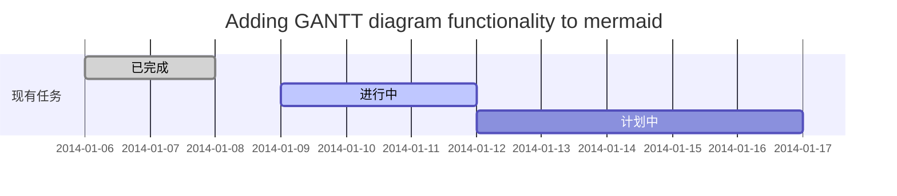
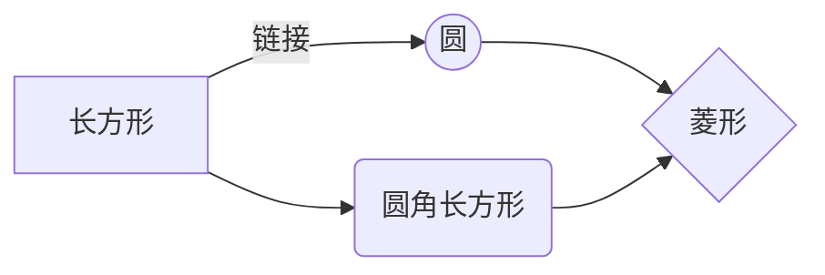

# 欢迎使用Markdown编辑器写博客

---------------------------

撤销：Ctrl/Command + Z

重做：Ctrl/Command + Y

加粗：Ctrl/Command + B

斜体：Ctrl/Command + I

标题：Ctrl/Command + Shift + H

无序列表：Ctrl/Command + Shift + U

有序列表：Ctrl/Command + Shift + O

检查列表：Ctrl/Command + Shift + C

插入代码：Ctrl/Command + Shift + K

插入链接：Ctrl/Command + Shift + L

插入图片：Ctrl/Command + Shift + G

标题

---------------------------

# 1级标题

## 2级标题

### 3级标题

#### 四级标题

##### 五级标题

###### 陆级标题

文本样式

---------------------------

*强调文本* _强调文本_

**加粗文本** __加粗文本__

==标记文本==

~~删除文本~~

> 引用文本

H~2~O is是液体。

2^10^ 运算结果是 1024。

列表

---------------------------

- 项目

* 项目

+ 项目

1. 项目1

2. 项目2

3. 项目3

- [ ] 计划任务

- [x] 完成任务

链接

---------------------------

链接: [link](https://mp.csdn.net).

图片: 

带尺寸的图片: 

代码片

---------------------------

下面展示一些 `内联代码片`。

```

// A code block

var foo = 'bar';

```

```javascript

// An highlighted block

var foo = 'bar';

```

1. 代码片必须手动声明代码语言类型

2. 目前支持代码类型: `markup`、`html`、`svg`、`xml`、`c`、`clike`、`cpp`、`csharp`、`java`、`vbnet`、`go`、`ruby/rb`、`python/py`、`php`、`sql`、`perl`、`objectivec`、`swift`、`javascript/js`、`css`、`handlebars`、`bash`、`kotlin`

3. 代码片主题

默认主题为：Atom One Dark

可以前往 [**写作中心/博客设置**](https://mp.csdn.net/configure) 在**代码片样式**项进行更改

表格

---------------------------

项目 | Value

-------- | -----

电脑 | $1600

手机 | $12

导管 | $1

| Column 1 | Column 2 |

|:--------:| -------------:|

| centered 文本居中 | right-aligned 文本居右 |

自定义列表

---------------------------

Markdown

: Text-to-HTML conversion tool

Authors

: John

: Luke

注脚

---------------------------

一个具有注脚的文本。[^1]

[^1]: 注脚的解释

注释

---------------------------

Markdown将文本转换为 HTML。

*[HTML]: 超文本标记语言

KaTex 数学公式

---------------------------

Gamma公式展示 $\Gamma(n) = (n-1)!\quad\forall

n\in\mathbb N$ 是通过 Euler integral

$$

\Gamma(z) = \int_0^\infty t^{z-1}e^{-t}dt\,.

$$

新的数学公式使用了KaTex，其语法与 LaTex基本一致，但也有一些不同的地方，具体请参考KaTex官方使用文档： [https://katex.org/docs/supported.html](https://katex.org/docs/supported.html)

插入甘特图

---------------------------



插入UML图

------------

```mermaid

sequenceDiagram

张三 ->> 李四: 你好！李四, 最近怎么样?

李四-->>王五: 你最近怎么样，王五？

李四--x 张三: 我很好，谢谢!

李四-x 王五: 我很好，谢谢!

Note right of 王五: 李四想了很长时间, 文字太长了
不适合放在一行.

李四-->>张三: 打量着王五...

张三->>王五: 很好... 王五, 你怎么样?

```

插入Mermaid流程图

--------



插入Flowchart流程图

-------

```mermaid

flowchat

st=>start: 开始

e=>end: 结束

op=>operation: 我的操作

cond=>condition: 确认？

st->op->cond

cond(yes)->e

cond(no)->op

```
————————————————
版权声明：本文为CSDN博主「CSDN官方博客」的原创文章，遵循CC 4.0 BY-SA版权协议，转载请附上原文出处链接及本声明。
原文链接：https://blog.csdn.net/blogdevteam/article/details/103478461